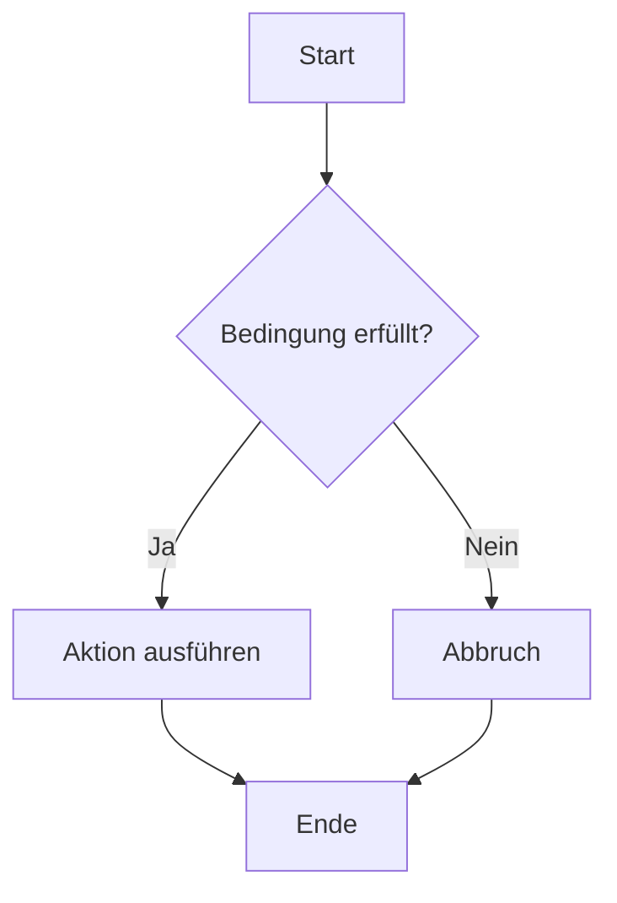

# Hello GitHub Workshop

Lorem ipsum blablabla...

[🐞 Bug melden](https://github.com/GregorBiswanger/t800-hello-github/issues/new?template=bug_report.md&labels=bug&title=Fehler%20gefunden)

```mermaid
graph TD
    A[Start] --> B{Bedingung erfüllt?}
    B -->|Ja| C[Aktion ausführen]
    B -->|Nein| D[Abbruch]
    C --> E[Ende]
    D --> E
```
